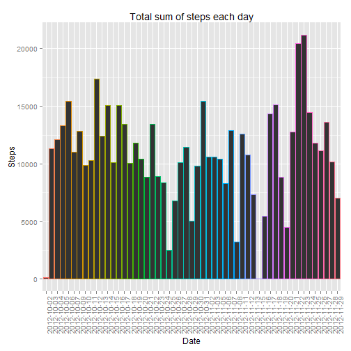
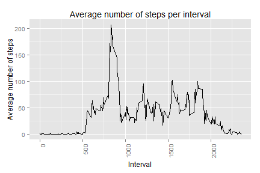
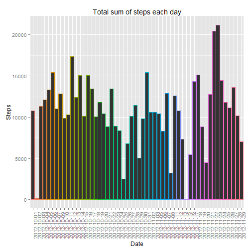
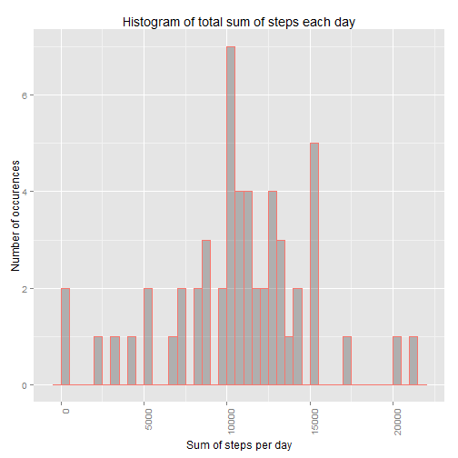
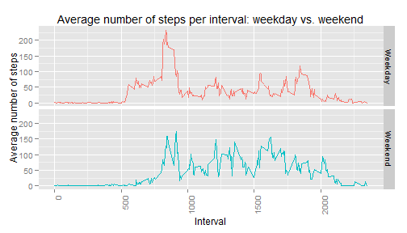

### Reproducible Research: Programming Assignment 1


#### Introduction

This assignment makes use of data from a personal activity monitoring device. This device collects data at 5 minute intervals through out the day. The data consists of two months of data from an anonymous individual collected during the months of October and November, 2012 and include the number of steps taken in 5 minute intervals each day.

## 1. Loading and preprocessing the data

```r
unzip("repdata-data-activity.zip")
```

```
## Warning in unzip("repdata-data-activity.zip"): error 1 in extracting from
## zip file
```

```r
data <- read.csv("activity.csv")
```

```
## Warning in file(file, "rt"): cannot open file 'activity.csv': No such file
## or directory
```

```
## Error in file(file, "rt"): cannot open the connection
```

```r
head(data)
```

```
##   steps       date interval
## 1    NA 2012-10-01        0
## 2    NA 2012-10-01        5
## 3    NA 2012-10-01       10
## 4    NA 2012-10-01       15
## 5    NA 2012-10-01       20
## 6    NA 2012-10-01       25
```

## 2. What is mean total number of steps taken per day?

##### 2.1. Histogram of the total number of steps taken each day:

Prepare the data - ignore NAs and aggregate the steps by date:


```r
data_subset <- data[!(is.na(data$step) | is.na(data$date) | is.na(data$interval)),]
data_subset_agg <- aggregate(steps~date,data_subset,sum)
library(ggplot2)
```

This is the code for the plot of the total number of steps per day:


```r
g1 <- ggplot(data_subset_agg, aes(x=date, y=steps, colour = date)) +
      geom_bar(stat = "identity") +
      guides(colour = FALSE) + 
      labs(title = "Total sum of steps each day" ) +
      labs(x = "Date", y = "Steps") +
      theme(axis.text.x = element_text(angle = 90, hjust = 1))
```

This is the code for the histogram of the daily total number of steps:


```r
g2 <- ggplot(data_subset_agg, aes(x=steps, color = "red")) +
      geom_histogram(binwidth = 500, stat="bin", alpha = 0.3) + 
      guides(color = FALSE) +
      labs(title = "Histogram of total sum of steps each day" ) +
      labs(x = "Sum of steps per day", y = "Number of occurences") +
      theme(axis.text.x = element_text(angle = 90, hjust = 1))
```



##### 2.2. Calculate and report the mean and median total number of steps taken per day


```r
stepsMean   <- mean(data_subset_agg$steps)
stepsMedian <- median(data_subset_agg$steps)
print(c(stepsMean, stepsMedian))
```

```
## [1] 10766.19 10765.00
```

Mean value of the total number of steps per day is: `stepsMean` = 1.0766189 &times; 10<sup>4</sup>.

Median value of the total number of steps per day is: `stepsMedian` = 10765.


## 3. What is the average daily activity pattern?

##### 3.1. Time series plot of the 5-minute interval (x-axis) and the average number of steps taken, averaged across all days (y-axis)


```r
data_subset2_agg <- aggregate(steps~interval,data_subset,mean)
library(ggplot2)
ggplot(data_subset2_agg, aes(x=interval, y=steps)) +
      geom_line() +
      labs(colour = FALSE) + 
      labs(title = "Average number of steps per interval" ) + 
      labs(x = "Interval", y = "Average number of steps") +
      theme(axis.text.x = element_text(angle = 90, hjust = 1))
```

 

##### 3.2. Which 5-minute interval, on average across all the days in the dataset, contains the maximum number of steps?


```r
intervalMax <- data_subset2_agg$interval[which.max(data_subset2_agg$steps)]
hours <- floor(intervalMax/max(data$interval)*24)
mins <- floor((intervalMax/max(data$interval)*24 - hours)*60)
timeVar <- paste(hours,':',mins, sep='')
```

Interval `intervalMax` = 835  contains the maximum number of steps.
This occurs at hour: `timeVar` = 8:30.

## 4. Imputing missing values

##### 4.1. Calculate and report the total number of missing values in the dataset (i.e. the total number of rows with NAs)


```r
NArows <- sum(is.na(data$step))
print(NArows)
```

```
## [1] 2304
```

There are 2304 rows with missing values.

##### 4.2. Strategy for filling in all of the missing values: 

Mean for that that 5-minute interval.

##### 4.3. Creating a new dataset that is equal to the original dataset but with the missing data filled in:


```r
indNA <- is.na(data$step)
names(data_subset2_agg)[2] = "steps_average_by_interval"
data2 <- merge(data,data_subset2_agg,by ="interval")
data2$steps[indNA] <- data2$steps_average_by_interval[indNA]
data2$steps_average_by_interval <- NULL

data2 <- data
data2$steps[is.na(data2$steps)] <- data_subset2_agg$steps[which(data_subset2_agg$interval == data2$interval[is.na(data2$steps)])]
```

##### 4.4. Show histogram of the total number of steps taken each day and Calculate and report the mean and median total number of steps taken per day. Do these values differ from the estimates from the first part of the assignment? What is the impact of imputing missing data on the estimates of the total daily number of steps?


```r
data2_agg <- aggregate(steps~date,data2,sum)
library(ggplot2)
g1 <- ggplot(data2_agg, aes(x=date, y=steps, colour = date)) +
      geom_bar(stat = "identity") +
      guides(colour = FALSE) + 
      labs(title = "Total sum of steps each day" ) +
      labs(x = "Date", y = "Steps") +
      theme(axis.text.x = element_text(angle = 90, hjust = 1))
```


```r
g2 <- ggplot(data2_agg, aes(x=steps, color = "red")) +
      geom_histogram(binwidth = 500, stat="bin", alpha = 0.3) + 
      guides(color = FALSE) +
      labs(title = "Histogram of total sum of steps each day" ) +
      labs(x = "Sum of steps per day", y = "Number of occurences") +
      theme(axis.text.x = element_text(angle = 90, hjust = 1))
```




```r
stepsMean   <- mean(data2_agg$steps)
stepsMedian <- median(data2_agg$steps)
print(c(stepsMean, stepsMedian))
```

```
## [1] 10766.19 10765.59
```

Mean value of the total number of steps per day is: `stepsMean` = 1.0766189 &times; 10<sup>4</sup>.

Median value of the total number of steps per day is: `stepsMedian` = 1.0765594 &times; 10<sup>4</sup>.

In this case imputing missing values had a small effect on the estimates.


## 5. Are there differences in activity patterns between weekdays and weekends?


##### 5.1. Create a new factor variable in the dataset with two levels – “weekday” and “weekend” indicating whether a given date is a weekday or weekend day.


```r
data2$day <- weekdays(as.Date(data2$date))
data2$weekpart <- 0
data2$weekpart[data2$day=="subota" | data2$day=="nedjelja"] <- 1
data2$weekpart <- factor(data2$weekpart, labels = c("Weekday","Weekend"))
```

##### 5.2. Make a panel plot containing a time series plot (i.e. type = "l") of the 5-minute interval (x-axis) and the average number of steps taken, averaged across all weekday days or weekend days (y-axis).


```r
data2_agg2 <- aggregate(steps~interval+weekpart,data2,mean)
ggplot(data2_agg2, aes(x=interval, y=steps, colour = weekpart)) + 
      facet_grid(weekpart~.) + 
      geom_line() +
      guides(colour = FALSE) + 
      labs(title = "Average number of steps per interval: weekday vs. weekend" ) + 
      labs(x = "Interval", y = "Average number of steps") +
      theme(axis.text.x = element_text(angle = 90, hjust = 1))
```

 

From these graphs, we can notice that in average people walk more during the weekends and during the whole day, unlike on weekdays when there is an obvious peek in the morning.
